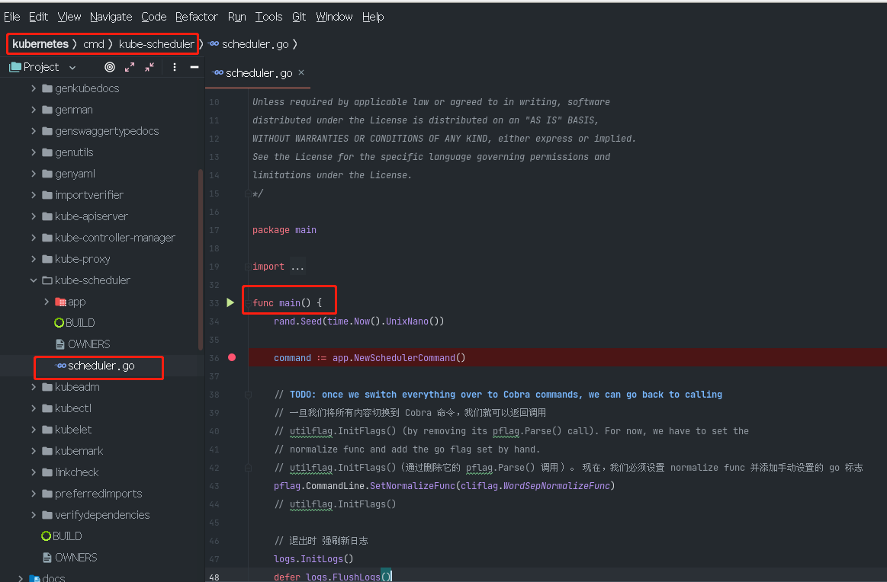
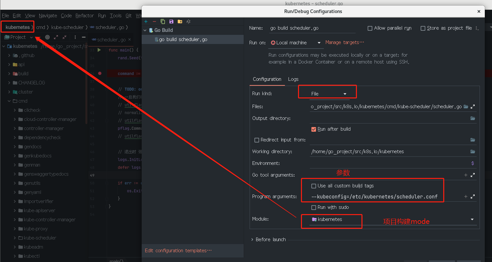
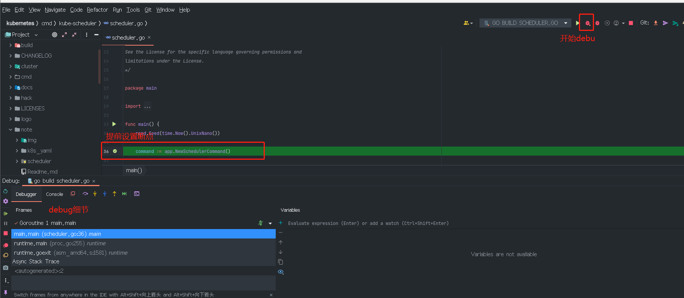
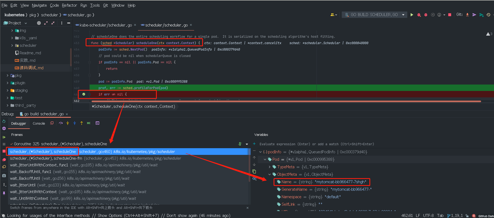

# 源码调试

> [参考链接](https://mp.weixin.qq.com/s/TTcnXkrRgFUQ6W0KjWssXA)

# 1.查看当前pod状态:

```shell
[root@master ~]# kubectl get po -n kube-system
NAME                             READY   STATUS    RESTARTS       AGE
coredns-78fcd69978-6f4v9         1/1     Running   5 (43m ago)    4d2h
coredns-78fcd69978-w9lwn         1/1     Running   5 (43m ago)    4d2h
etcd-master                      1/1     Running   22 (43m ago)   4d2h
kube-apiserver-master            1/1     Running   22 (43m ago)   4d2h
kube-controller-manager-master   1/1     Running   7 (43m ago)    4d2h
kube-flannel-ds-rpd24            1/1     Running   5 (43m ago)    4d2h
kube-proxy-6d6tq                 1/1     Running   5 (43m ago)    4d2h
kube-scheduler-master            1/1     Running   7 (43m ago)    4d2h

```

# 2.挪开yaml文件，让scheduler停止：

```shell
[root@master ~]# mv /etc/kubernetes/manifests/kube-scheduler.yaml /home/
[root@master ~]# kubectl get po -n kube-system -o wide
NAME                             READY   STATUS    RESTARTS       AGE    IP                NODE     NOMINATED NODE   READINESS GATES
coredns-78fcd69978-6f4v9         1/1     Running   5 (46m ago)    4d3h   192.168.0.13      master   <none>           <none>
coredns-78fcd69978-w9lwn         1/1     Running   5 (46m ago)    4d3h   192.168.0.14      master   <none>           <none>
etcd-master                      1/1     Running   22 (46m ago)   4d3h   192.168.192.128   master   <none>           <none>
kube-apiserver-master            1/1     Running   22 (46m ago)   4d3h   192.168.192.128   master   <none>           <none>
kube-controller-manager-master   1/1     Running   7 (46m ago)    4d2h   192.168.192.128   master   <none>           <none>
kube-flannel-ds-rpd24            1/1     Running   5 (46m ago)    4d2h   192.168.192.128   master   <none>           <none>
kube-proxy-6d6tq                 1/1     Running   5 (46m ago)    4d3h   192.168.192.128   master   <none>           <none>
```

# 3.配置goland



## 3.1 构建配置
在main函数前面点一下这个绿色的三角形，当然这样运行肯定会失败，但是点一下会为我们生成一些配置，可以简化很多事情。点完之后开始配置：



这里的Program arguments默认是空的，从前面挪动的 kube-scheduler.yaml 中可以看到如下配置：
```yaml
apiVersion: v1
kind: Pod
metadata:
  creationTimestamp: null
  labels:
    component: kube-scheduler
    tier: control-plane
  name: kube-scheduler
  namespace: kube-system
spec:
  containers:
  - command:
    - kube-scheduler
    - --authentication-kubeconfig=/etc/kubernetes/scheduler.conf
    - --authorization-kubeconfig=/etc/kubernetes/scheduler.conf
    - --bind-address=127.0.0.1
    - --kubeconfig=/etc/kubernetes/scheduler.conf
    - --leader-elect=true
...
```

## 3.2 设置断点
cmd/kube-scheduler/scheduler.go -> main()
```go
func main() {
	rand.Seed(time.Now().UnixNano())
	command := app.NewSchedulerCommand()
	...
```

## 3.3 debug




## 3.4 交互

创建这个Deployment之后查看pod是pending状态

```shell
[root@master ~]# kubectl create -f k8s/tomcat-deploy.yaml 
deployment.apps/mytomcat created
[root@master ~]# 
[root@master ~]# 
[root@master ~]# kubectl get po
NAME                      READY   STATUS    RESTARTS   AGE
mytomcat-bb966477-7shgh   0/1     Pending   0          5s
[root@master ~]# 
```

## 3.5 调整断点(把断点打在scheduleOne()里面)

pkg/scheduler/scheduler.go -> scheduleOne()

```go
func (sched *Scheduler) scheduleOne(ctx context.Context) {
	podInfo := sched.NextPod()
	// pod could be nil when schedulerQueue is closed
	if podInfo == nil || podInfo.Pod == nil {
		return
	}
	pod := podInfo.Pod
	...
```



## 3.6 查看pod 当前状态

```shell
[root@master ~]# kubectl get po
NAME                      READY   STATUS    RESTARTS   AGE
mytomcat-bb966477-7shgh   0/1     Pending   0          55m

```


